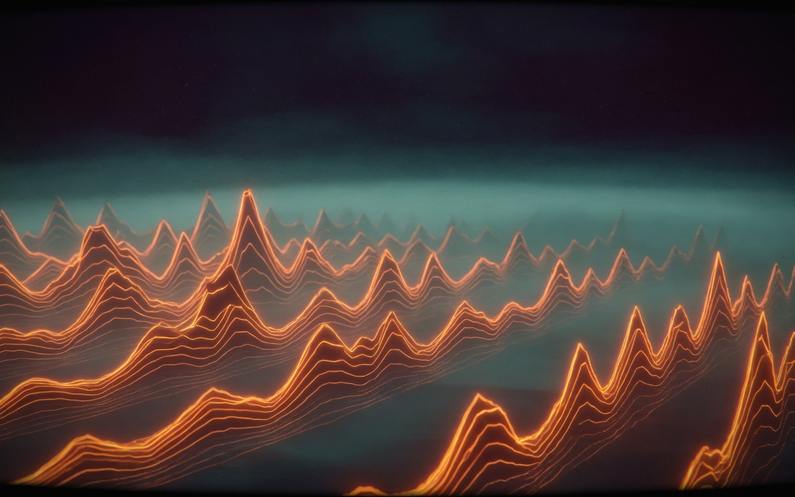

# SCViz

A Chrome extension that adds a **visualizer / playing mode** to [SoundCloud](https://soundcloud.com).

While a track plays, a button appears in the player bar. Toggle it and the page becomes a full-screen visualizer. SoundCloud’s play bar stays. The waveform stays at the bottom, with a live oscilloscope over it. Comments can sit on the waveform, pop as bubbles, or hide.

**This project is not affiliated with SoundCloud.**

[](LICENSE)

<p>
  
  
</p>
<p>
  
  
</p>

## Visualizers

| Mode | What you get |
|---|---|
| **Pulse** | Glowing wireframe orb that distorts with the music |
| **Ridge** | Receding Joy Division–style spectrum ridges |
| **Bloom** | Particle nebula that breathes with bass |
| **Magnetosphere** | Cinematic take on Robert Hodgin’s iTunes visualizer: charged particles, trails, dark cores, atmosphere |

Cycle with **V** or the HUD. Open **Knobs** (or **T**) to tune the active mode.

## Install (development)

1. Open `chrome://extensions`
2. Turn on **Developer mode**
3. **Load unpacked** and select this folder
4. Open [soundcloud.com](https://soundcloud.com), play a track, click the visualizer button in the bottom player

Chrome may warn that the extension can capture tab audio. That feed stays in the tab and only drives the visualizer while playing mode is on.

**Chrome Web Store:** see [`store/CHECKLIST.md`](store/CHECKLIST.md). Package with `scripts/package-extension.sh`.

## Use

| Input | Action |
|---|---|
| Player-bar button, extension icon, or `Alt+V` | Toggle playing mode |
| `Esc` | Exit |
| `V` | Cycle visualizer |
| `C` | Comments on/off |
| `W` | Waveform on/off |
| `T` | Knobs on/off |
| Click the waveform or a comment | Seek |

With the waveform off, the title and HUD fade after a few idle seconds. Move the mouse to bring them back.

## Privacy

No accounts, no analytics, no developer backend. Preferences stay in `chrome.storage.local`. Tab audio is analysed locally. Full policy: [`PRIVACY.md`](PRIVACY.md).

## Lab

Open [`preview.html`](preview.html) on a local static server (no SoundCloud required):

```bash
python3 -m http.server 8765
# http://127.0.0.1:8765/preview.html
```

Load or drop an MP3. `H` hides chrome. `?mode=ridge&hide=1` is useful for stills.

## Layout

```
manifest.json
background.js            # toggle, tabCapture id, fetch proxy
src/page-bridge.js       # MAIN-world audio tap + client id
src/content.js           # overlay, button, comments, knobs
src/visualizer.js        # Three.js modes + waveform
src/magnetosphere-post.js
src/frame.js
src/overlay.css
src/vendor/three.min.js
preview.html
store/                   # Chrome Web Store copy + assets
```

## Credits

Three.js (MIT). Magnetosphere is inspired by Robert Hodgin / The Barbarian Group’s iTunes visualizer; this is an original recreation, not an official port. Pulse draws on public Three.js / Codrops audio-visualization demos. See [`NOTICE`](NOTICE).

## License

[MIT](LICENSE)
